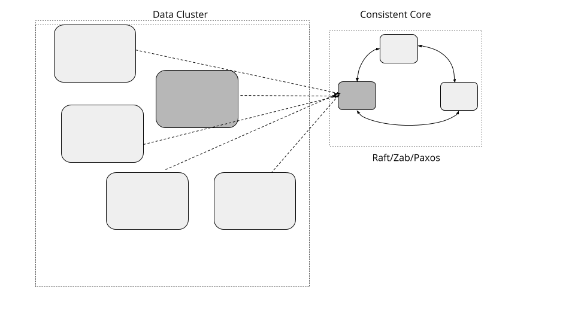

# 一致性内核（Consistent Core）

**原文**

https://martinfowler.com/articles/patterns-of-distributed-systems/consistent-core.html

维护一个较小的内核，为大规模数据集群提供更强的一致性，这样，可以在无需实现基于 Quorum 算法的前提下协调服务器行为。

**2021.1.5**

## 问题

集群需要处理大规模的数据，就需要越来越多的服务器。对于服务器集群而言，有一些通用性的需求，比如，选择某个特定的服务器成为某个任务的主节点、管理分组成员信息、将数据分区映射到服务器上等等。这些需求都需要强一致性的保证，也就是说，要有线性一致性。实现本身还要有对失效的容忍。一种常见的方式是，使用一种基于 [Quorum](https://martinfowler.com/articles/patterns-of-distributed-systems/quorum.html) 且支持失效容忍的一致性算法。但是，基于 Quorum 的系统会降低集群的吞吐规模。

## 解决方案

实现一个三五个节点的小集群，提供线性一致性的保证，同时支持失效容忍[1]。一个单独数据集群可以使用小的一致性集群管理元数据，采用类似于[租约（Lease）](https://martinfowler.com/articles/patterns-of-distributed-systems/time-bound-lease.html) 之类的原语在集群范围内进行决策。这样一来，数据集群就可以增长到很大的规模，但对于某些需要强一致性保证的动作，可以使用比较小的元数据集群。


<center>图1：一致性内核</center>

一个典型一致性内核接口应该是下面这个样子：

```java
public interface ConsistentCore {
    CompletableFuture put(String key, String value);
    List<String> get(String keyPrefix);
    CompletableFuture registerLease(String name, long ttl);
    void refreshLease(String name);
    void watch(String name, Consumer<WatchEvent> watchCallback);
}
```
以最低的标准看，一致性内核提供了一个简单的键值存储机制，用于存储元数据。

### 元数据存储

存储可以用诸如 Raft 之类的共识算法实现。它是可复制的预写日志的一个样例实现，其中的复制由[领导者和追随者（Leader and Followers）](https://martinfowler.com/articles/patterns-of-distributed-systems/leader-follower.html) 进行处理，使用 [Quorum](https://martinfowler.com/articles/patterns-of-distributed-systems/quorum.html) 的话，可以使用[高水位标记（High-Water Mark）](high-water-mark.md)追踪成功的复制。

#### 支持层级结构的存储

一致性内核通常用于存储这样的数据，比如，分组成员、跨服务器的任务分布。一种常见的使用模式是，通过前缀将元数据的类型做一个分类，比如，对于分组成员信息，键值可以存成类似于 /servers/1、servers/2 等等。对于任务分配给哪些服务器，键值可以是 /tasks/task1、/tasks/task2。通常来说，要读取这些数据，所有的键值上都要带上特定的前缀。比如，要读取集群中的所有服务器信息，就要读取所有与以 /servers 为前缀的键值。

下面是一个示例的用法：

服务器只要创建一个属于自己的有 /servers 前缀的键值，就可以将自身注册到一致性内核中。

```java
client1.setValue("/servers/1", "{address:192.168.199.10, port:8000}");
client2.setValue("/servers/2", "{address:192.168.199.11, port:8000}");
client3.setValue("/servers/3", "{address:192.168.199.12, port:8000}");
```

客户端只要读取以 /servers 为前缀的键值，就可以获取所有集群中的服务器信息，像下面这样：


```java
assertEquals(client1.getValue("/servers"), Arrays.asList(
  "{address:192.168.199.12, port:8000}",
  "{address:192.168.199.11, port:8000}",
  "{address:192.168.199.10, port:8000}"));
```

因为数据存储的层次结构属性，像 [zookeeper](https://zookeeper.apache.org/)、[chubby](https://research.google/pubs/pub27897/) 提供了类似于文件系统的接口，其中，用户可以创建目录和文件，或是节点，有父子节点概念的那种。[etcd3](https://coreos.com/blog/etcd3-a-new-etcd.html) 有扁平的键值空间，这样它就能力获取更大范围的键值。

### 处理客户端交互

一致性内核功能的一个关键需求是，客户端如何与内核进行交互。下面是客户端与一致性内核协同工作的关键方面。

#### 找到领导者

所有的操作都要在领导者上执行，这是至关重要的，因此，客户端程序库需要先找到 领导者服务器。要做到这一点，有两种可能的方式。

* 一致性内核的追随者服务器知道当前的领导者，因此，如果客户端连接追随者，它会返回 领导者的地址。客户端可以直接连接应答中给出的 领导者。值得注意的是，客户端尝试连接时，服务器可能正处于领导者选举过程中。在这种情况下，服务器无法返回领导者地址，客户端需要等待片刻，再尝试连接另外的服务器。

* 服务器实现转发机制，将所有的客户端请求转发给 领导者。这样就允许客户端连接任意的服务器。同样，如果服务器处于领导者 选举过程中，客户端需要不断重试，直到领导者选举成功，一个合法的领导者获得确认。

    类似于 zookeeper 和 etcd 这样的产品都实现了这种方式，它们允许追随者 服务器处理只读请求，以免领导者面对大量客户端的只读请求时出现瓶颈。这就降低了客户端基于请求类型去连接领导者或追随者的复杂性。

一个找到领导者的简单机制是，尝试连接每一台服务器，尝试发送一个请求，如果服务器不是领导者，它给出的应答就是一个重定向的应答。

```java
private void establishConnectionToLeader(List<InetAddressAndPort> servers) {
    for (InetAddressAndPort server : servers) {
        try {
            SingleSocketChannel socketChannel = new SingleSocketChannel(server, 10);
            logger.info("Trying to connect to " + server);
            RequestOrResponse response = sendConnectRequest(socketChannel);
            if (isRedirectResponse(response)) {
                redirectToLeader(response);
                break;
            } else if (isLookingForLeader(response)) {
                logger.info("Server is looking for leader. Trying next server");
                continue;
            } else { //we know the leader
                logger.info("Found leader. Establishing a new connection.");
                newPipelinedConnection(server);
                break;
            }
        } catch (IOException e) {
            logger.info("Unable to connect to " + server);
            //try next server
        }
    }
}

private boolean isLookingForLeader(RequestOrResponse requestOrResponse) {
    return requestOrResponse.getRequestId() == RequestId.LookingForLeader.getId();
}

private void redirectToLeader(RequestOrResponse response) {
    RedirectToLeaderResponse redirectResponse = deserialize(response);
    newPipelinedConnection(redirectResponse.leaderAddress);
    logger.info("Connected to the new leader "
            + redirectResponse.leaderServerId
            + " " + redirectResponse.leaderAddress
            + ". Checking connection");
}

private boolean isRedirectResponse(RequestOrResponse requestOrResponse) {
    return requestOrResponse.getRequestId() == RequestId.RedirectToLeader.getId();
}
```

仅仅建立 TCP 连接还不够，我们还需要知道服务器能否处理我们的请求。因此，客户端会给服务器发送一个特殊的连接请求，服务器需要响应，它是可以处理请求，还是要重定向到领导者服务器上。

```java
private RequestOrResponse sendConnectRequest(SingleSocketChannel socketChannel) throws IOException {
    RequestOrResponse request
        = new RequestOrResponse(RequestId.ConnectRequest.getId(), "CONNECT", 0);
    try {
        return socketChannel.blockingSend(request);
    } catch (IOException e) {
        resetConnectionToLeader();
        throw e;
    }
}
```

如果既有的领导者失效了，同样的技术将用于识别集群中新选出的领导者。

一旦连接成功，客户端将同领导者服务器间维持一个[单一 Socket 通道（Single Socket Channel）](https://martinfowler.com/articles/patterns-of-distributed-systems/single-socket-channel.html)。

#### 处理重复请求

在失效的场景下，客户端可以重新连接新的 领导者，重新发送请求。但是，如果这些请求在失效的领导者之前已经处理过了，这就有可能产生重复。因此，至关重要的一点是，服务器需要有一种机制，忽略重复的请求。[幂等接收者（Idempotent Receiver）](idempotent-receiver.md)模式就是用来实现重复检测的。

使用[租约（Lease）](https://martinfowler.com/articles/patterns-of-distributed-systems/time-bound-lease.html)，可以在一组服务器上协调任务。同样的技术也可以用于实现分组成员信息和失效检测机制。

[状态监控（State Watch）](https://martinfowler.com/articles/patterns-of-distributed-systems/state-watch.html)，可以在元数据发生改变，或是基于时间的租约到期时，获得通知。

## 示例

众所周知，Google 使用 [chubby](https://research.google/pubs/pub27897/) 锁服务进行协调和元数据管理。

[kafka](https://kafka.apache.org/) 使用 [zookeeper](https://zookeeper.apache.org/) 管理元数据，以及类似于为集群主节点进行 Leader 选举之类的决策。Kafka 中[提议的一个架构调整](https://cwiki.apache.org/confluence/display/KAFKA/KIP-500%3A+Replace+ZooKeeper+with+a+Self-Managed+Metadata+Quorum)是使用自己基于 [raft](https://raft.github.io/) 的控制器集群替换 Zookeeper。

[bookkeeper](https://bookkeeper.apache.org/) 使用 Zookeeper 管理集群的元数据。

[kubernetes](https://kubernetes.io/) 使用 [etcd](https://etcd.io/) 进行协调、管理集群的元数据，分组成员信息。

所有的大数据存储和处理系统类似于 [hdfs](https://hadoop.apache.org/docs/r3.0.0/hadoop-project-dist/hadoop-hdfs/HDFSHighAvailabilityWithNFS.html)、[spark](http://spark.apache.org/docs/latest/spark-standalone.html#standby-masters-with-zookeeper)、[flink](https://ci.apache.org/projects/flink/flink-docs-release-1.11/ops/jobmanager_high_availability.html) 都使用 [zookeeper](https://zookeeper.apache.org/) 实现高可用以及集群协调。

