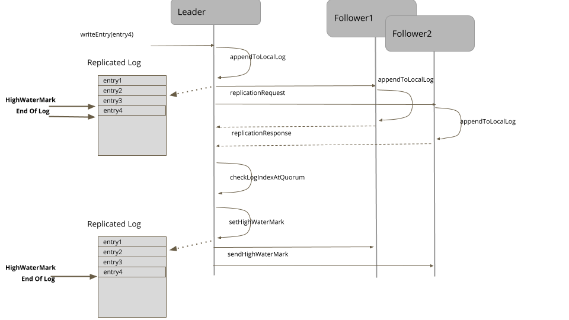
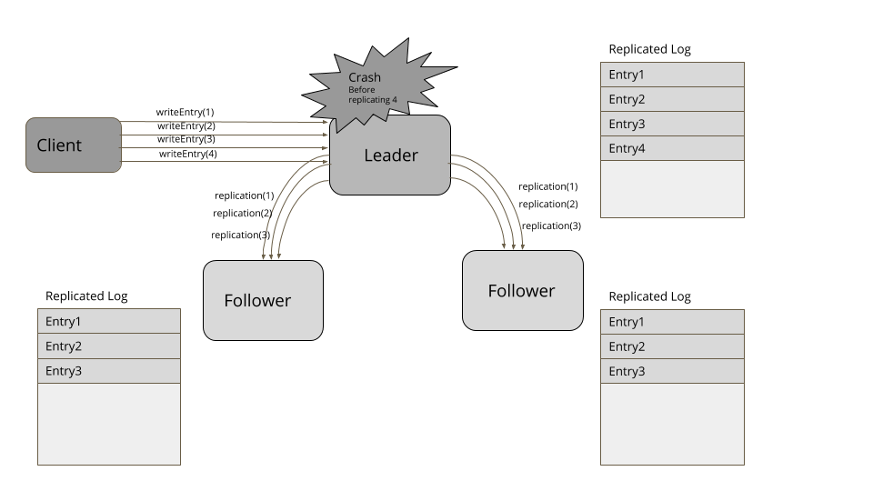
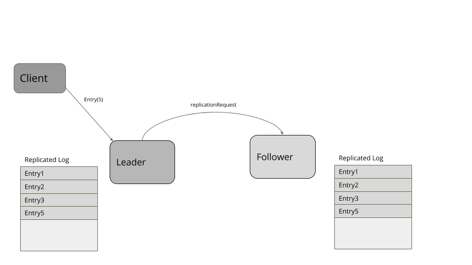

# 高水位标记（High-Water Mark）

**原文**

https://martinfowler.com/articles/patterns-of-distributed-systems/high-watermark.html

预写日志中的索引，表示最后一次成功的复制。

**2020.8.5**

又称：提交索引

## 问题

[预写日志（Write-Ahead Log）](https://martinfowler.com/articles/patterns-of-distributed-systems/wal.html)模式用于在服务器奔溃重启之后恢复状态。但在服务器失效的情况下，想要保障可用性，仅有预写日志是不够的。如果单个服务器失效了，只有等到服务器重启之后，客户端才能够继续使用其功能。为了得到一个更可用的系统，我们需要将日志复制到多台服务器上。使用[领导者和追随者（Leader and Followers）](leader-and-followers.md)时，领导者会将所有的日志条目都复制到追随者的 [Quorum](quorum.md) 上。如果领导者失效了，集群会选出一个新的领导者，客户端在大部分情况下还是能像从前一样继续在集群中工作。但是，还有几件事可能会有问题：

* 在向任意的追随者发送日志条目之前，领导者失效了。
* 给一部分追随者发送日志条目之后，领导者失效了，日志条目没有发送给大部分的追随者。

在这些错误的场景下，一部分追随者的日志中可能会缺失一些条目，一部分追随者则拥有比其它部分多的日志条目。因此，对于每个追随者来说，有一点变得很重要，了解日志中哪个部分是安全的，对客户端是可用的。

## 解决方案

高水位标记就是一个日志文件中的索引，记录了在追随者的 [Quorum](quorum.md) 中都成功复制的最后一个日志条目。在复制期间，领导者也会把高水位标记传给追随者。对于集群中的所有服务器而言，只有反映的更新小于高水位标记的数据才能传输给客户端。

下面是这个操作的序列图。


<center>图1：高水位标记</center>

对于每个日志条目而言，领导者将其追加到本地的预写日志中，然后，发送给所有的追随者。

```java
leader (class ReplicationModule...)
  private Long appendAndReplicate(byte[] data) {
      Long lastLogEntryIndex = appendToLocalLog(data);
      logger.info("Replicating log entries till index " + lastLogEntryIndex + " on followers");
      replicateOnFollowers(lastLogEntryIndex);
      return lastLogEntryIndex;
  }

  private void replicateOnFollowers(Long entryAtIndex) {
      for (final FollowerHandler follower : followers) {
          replicateOn(follower, entryAtIndex); //send replication requests to followers
      }
  }
```

追随者会处理复制请求，将日志条目追加到本地日志中。在成功地追加日志条目之后，它们会把最新的日志条目索引回给领导者。应答中还包括服务器当前的[时代时钟（Generation Clock）](generation-clock.md)。

```java
follower (class ReplicationModule...)
  private ReplicationResponse handleReplicationRequest(ReplicationRequest replicationRequest) {
      List<WALEntry> entries = replicationRequest.getEntries();
      for (WALEntry entry : entries) {
          logger.info("Appending log entry " + entry.getEntryId() + " in " + serverId());
          if (wal.exists(entry)) {
              logger.info("Entry " + wal.readAt(entry.getEntryId()) + " already exists on " + config.getServerId());
              continue;
          }
          wal.writeEntry(entry);
      }
      return new ReplicationResponse(SUCCEEDED, serverId(), replicationState.getGeneration(), wal.getLastLogEntryId());
  }
```

领导者在收到应答时，会追踪每台服务器上已复制日志的索引。

```java
class ReplicationModule…
  recordReplicationConfirmedFor(response.getServerId(), response.getReplicatedLogIndex());
  long logIndexAtQuorum = computeHighwaterMark(logIndexesAtAllServers(), config.numberOfServers());
  logger.info("logIndexAtQuorum in " + config.getServerId() + " is " + logIndexAtQuorum + " highWaterMark is " + replicationState.getHighWaterMark());
  var currentHighWaterMark = replicationState.getHighWaterMark();
  if (logIndexAtQuorum > currentHighWaterMark) {
      applyLogAt(currentHighWaterMark, logIndexAtQuorum);
      logger.info("Setting highwatermark in " + config.getServerId() + " to " + logIndexAtQuorum);
      replicationState.setHighWaterMark(logIndexAtQuorum);
  } else {
      logger.info("HighWaterMark in " + config.getServerId() + " is " + replicationState.getHighWaterMark() + " >= " + logIndexAtQuorum);
  }
```

通过查看所有追随者的日志索引和领导者自身的日志，高水位标记是可以计算出来的，选取大多数服务器中可用的索引即可。

```java
class ReplicationModule…
  Long computeHighwaterMark(List<Long> serverLogIndexes, int noOfServers) {
      serverLogIndexes.sort(Long::compareTo);
      return serverLogIndexes.get(noOfServers / 2);
  }
```

领导者会将高水位标记传播给追随者，可能是当做常规心跳的一部分，也可能一个单独的请求。追随者随后据此设置自己的高水位标记。

客户端只能读取到高水位标记前的日志条目。超出高水位标记的对客户端是不可见的。因为这些条目是否复制还未确认，如果领导者失效了，其它服务器成了领导者，这些条目就是不可用的。

```java
class ReplicationModule…
  public WALEntry readEntry(long index) {
    if (index > replicationState.getHighWaterMark()) {
      throw new IllegalArgumentException("Log entry not available");
    }
    return wal.readAt(index);
  }
```

### 日志截断

一台服务器在崩溃/重启之后，重新加入集群，日志中总有可能出现一些冲突的条目。因此，每当有一台服务器加入集群时，它都会检查集群的领导者，了解日志中哪些条目可能是冲突的。然后，它会做一次日志截断，以便与领导者的条目相匹配，然后用随后的条目更新日志，以确保它的日志与集群的节点相匹配。

考虑下面这个例子。客户端发送请求在日志中添加四个条目。领导者成功地复制了三个条目，但在日志中添加了第四项后，失败了。一个新的追随者被选为新的领导者，从客户端接收了更多的项。当失效的领导者再次加入集群时，它的第四项就冲突了。因此，它要把自己的日志截断至第三项，然后，添加第五项，以便于集群的其它节点相匹配。


<center>图2：领导者失效</center>


<center>图3：新的领导者</center>


<center>图4：日志截断</center>

暂停之后，重新启动或是重新加入集群，服务器都会先去寻找新的领导者。然后，它会显式地查询当前的高水位标记，将日志截断至高水位标记，然后，从领导者那里获取超过高水位标记的所有条目。类似 RAFT 之类的复制算法有一些方式找出冲突项，比如，查看自己日志里的日志条目，对比请求里的日志条目。如果日志条目拥有相同的索引，但[时代时钟（Generation Clock）](generation-clock.md)更低的话，就删除这些条目。

```java
class ReplicationModule…
  private void maybeTruncate(ReplicationRequest replicationRequest) throws IOException {
      if (replicationRequest.hasNoEntries() || wal.isEmpty()) {
          return;
      }
      List<WALEntry> entries = replicationRequest.getEntries();
      for (WALEntry entry : entries) {
          if (wal.getLastLogEntryId() >= entry.getEntryId()) {
              if (entry.getGeneration() == wal.readAt(entry.getEntryId()).getGeneration()) {
                  continue;
              }
              wal.truncate(entry.getEntryId());
          }
      }
  }
```

要支持日志截断，有一种简单的实现，保存一个日志索引到文件位置的映射。这样，日志就可以按照给定的索引进行截断，如下所示：

```java
class WALSegment…
  public void truncate(Long logIndex) throws IOException {
      var filePosition = entryOffsets.get(logIndex);
      if (filePosition == null) throw new IllegalArgumentException("No file position available for logIndex=" + logIndex);

      fileChannel.truncate(filePosition);
      readAll();
  }
```

## 示例

* 所有共识算法都有高水位标记的概念，以便了解应用状态修改的时机，比如，在 [RAFT](https://raft.github.io/) 共识算法中，高水位标记称为“提交索引”。
* 在 [Kafka 的复制协议](https://www.confluent.io/blog/hands-free-kafka-replication-a-lesson-in-operational-simplicity/)中，维护着一个单独的索引，称为高水位标记。消费者只能看到高水位标记之前的条目。
* [Apache BookKeeper](https://bookkeeper.apache.org/) 有一个概念，叫‘[最后添加确认（last add confirmed）](https://bookkeeper.apache.org/archives/docs/r4.4.0/bookkeeperProtocol.html)’，它表示在 bookie 的 Quorum 上已经成功复制的条目。
