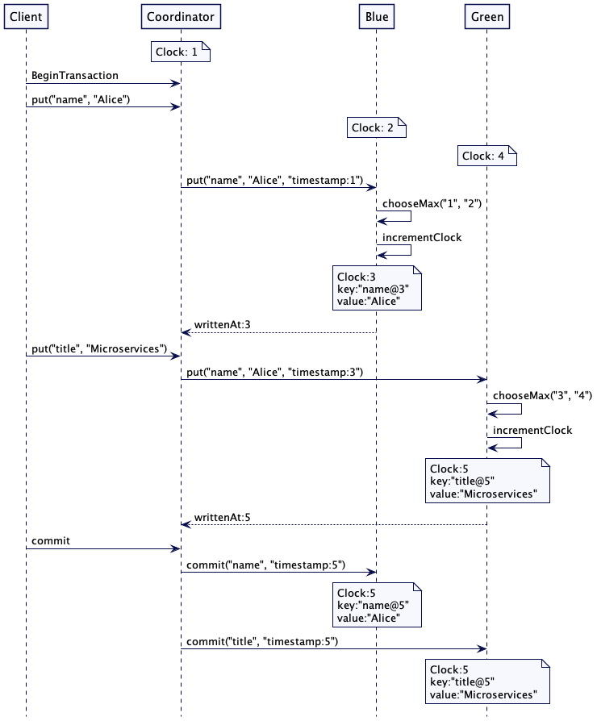

# 混合时钟（Hybrid Clock）

**原文**

https://martinfowler.com/articles/patterns-of-distributed-systems/hybrid-clock.html

使用系统时间戳和逻辑时间戳的组合，这样时间-日期就可以当做版本，用以排序。

**2021.6.24**

## 问题

采用[有版本的值（Versioned Value）](versioned-value.md)时，如果用 [Lamport 时钟](lamport-clock.md)当做版本，存储版本时，客户端并不知道实际的日期-时间。对于客户端而言，有时需要能够访问到像 01-01-2020 这样采用日期-时间的版本，而不仅仅是像 1、2、3 这样的整数。

## 解决方案

[混合逻辑时钟（Hybrid Logical Clock）](https://cse.buffalo.edu/tech-reports/2014-04.pdf) 提供了一种方式，让我们可以拥有一种像简单整数一样能够单调递增的版本，但与实际的日期时间也有关系。在实践中，像 [mongodb](https://www.mongodb.com/blog/post/transactions-background-part-4-the-global-logical-clock) 或 [cockroachdb](https://www.cockroachlabs.com/docs/stable/architecture/transaction-layer.html) 这样的数据就采用了混合时钟。

混合逻辑时钟可以这样实现：

```java
class HybridClock…

  public class HybridClock {
      private final SystemClock systemClock;
      private HybridTimestamp latestTime;
      public HybridClock(SystemClock systemClock) {
          this.systemClock = systemClock;
          this.latestTime = new HybridTimestamp(systemClock.currentTimeMillis(), 0);
      }
```

它在混合时间戳里维护了最新的时间，这个时间戳使用系统时间和整数计数器共同构建。

```java
class HybridTimestamp…

  public class HybridTimestamp implements Comparable<HybridTimestamp> {
      private final long wallClockTime;
      private final int ticks;

      public HybridTimestamp(long systemTime, int ticks) {
          this.wallClockTime = systemTime;
          this.ticks = ticks;
      }

      public static HybridTimestamp fromSystemTime(long systemTime) {
          return new HybridTimestamp(systemTime, -1); //initializing with -1 so that addTicks resets it to 0
      }

      public HybridTimestamp max(HybridTimestamp other) {
          if (this.getWallClockTime() == other.getWallClockTime()) {
              return this.getTicks() > other.getTicks()? this:other;
          }
          return this.getWallClockTime() > other.getWallClockTime()?this:other;
      }

      public long getWallClockTime() {
          return wallClockTime;
      }

      public HybridTimestamp addTicks(int ticks) {
          return new HybridTimestamp(wallClockTime, this.ticks + ticks);
      }

      public int getTicks() {
          return ticks;
      }

      @Override
      public int compareTo(HybridTimestamp other) {
          if (this.wallClockTime == other.wallClockTime) {
              return Integer.compare(this.ticks, other.ticks);
          }
          return Long.compare(this.wallClockTime, other.wallClockTime);
      }
```

混合时钟的使用方式与[Lamport Clock](lamport-clock.md)版本完全相同。每个服务器都持有一个混合时钟的实例。

```java
class Server…

  HybridClockMVCCStore mvccStore;
  HybridClock clock;

  public Server(HybridClockMVCCStore mvccStore) {
      this.clock = new HybridClock(new SystemClock());
      this.mvccStore = mvccStore;
  }
```

每次写入一个值，都会关联上一个混合时间戳。诀窍是检查系统时间值是否在往回走，如果是，则递增另一个代表组件逻辑部分的数字，以反映时钟的进展。

```java
class HybridClock…

  public synchronized HybridTimestamp now() {
      long currentTimeMillis = systemClock.currentTimeMillis();
      if (latestTime.getWallClockTime() >= currentTimeMillis) {
           latestTime = latestTime.addTicks(1);
      } else {
          latestTime = new HybridTimestamp(currentTimeMillis, 0);
      }
      return latestTime;
  }
```

服务器从客户端收到的每个写请求都会带有一个时间戳。接收的服务器会将自己的时间戳与请求的时间戳进行比较，将二者中较高的一个设置为自己的时间戳。

```java
class Server…

  public HybridTimestamp write(String key, String value, HybridTimestamp requestTimestamp) {
      //update own clock to reflect causality
      HybridTimestamp writeAtTimestamp = clock.tick(requestTimestamp);
      mvccStore.put(key, writeAtTimestamp, value);
      return writeAtTimestamp;
  }
class HybridClock…

  public synchronized HybridTimestamp tick(HybridTimestamp requestTime) {
      long nowMillis = systemClock.currentTimeMillis();
      //set ticks to -1, so that, if this is the max, the next addTicks reset it to zero.
      HybridTimestamp now = HybridTimestamp.fromSystemTime(nowMillis);
      latestTime = max(now, requestTime, latestTime);
      latestTime = latestTime.addTicks(1);
      return latestTime;
  }

  private HybridTimestamp max(HybridTimestamp ...times) {
      HybridTimestamp maxTime = times[0];
      for (int i = 1; i < times.length; i++) {
          maxTime = maxTime.max(times[i]);
      }
      return maxTime;
  }
```

用于写入值的时间戳会返回给客户端。请求的客户端会更新自己的时间戳，然后，在发起进一步的写入时会带上这个时间戳。

```java
class Client…

  HybridClock clock = new HybridClock(new SystemClock());
  public void write() {
      HybridTimestamp server1WrittenAt = server1.write("key1", "value1", clock.now());
      clock.tick(server1WrittenAt);

      HybridTimestamp server2WrittenAt = server2.write("key2", "value2", clock.now());

      assertTrue(server2WrittenAt.compareTo(server1WrittenAt) > 0);
  }
```

### 使用混合时钟进行多版本存储

在键值存储中进行值的存储时，可以采用混合时间戳作为版本。值的存储在[有版本的值（Versioned Value）](versioned-value.md)中讨论过。

```java
class HybridClockReplicatedKVStore…

  private Response applySetValueCommand(VersionedSetValueCommand setValueCommand) {
      mvccStore.put(setValueCommand.getKey(), setValueCommand.timestamp, setValueCommand.value);
      Response response = Response.success(setValueCommand.timestamp);
      return response;
  }
class HybridClockMVCCStore…

  ConcurrentSkipListMap<HybridClockKey, String> kv = new ConcurrentSkipListMap<>();

  public void put(String key, HybridTimestamp version, String value) {
      kv.put(new HybridClockKey(key, version), value);
  }
class HybridClockKey…

  public class HybridClockKey implements Comparable<HybridClockKey> {
      private String key;
      private HybridTimestamp version;

      public HybridClockKey(String key, HybridTimestamp version) {
          this.key = key;
          this.version = version;
      }

      public String getKey() {
          return key;
      }

      public HybridTimestamp getVersion() {
          return version;
      }

      @Override
      public int compareTo(HybridClockKey o) {
          int keyCompare = this.key.compareTo(o.key);
          if (keyCompare == 0) {
              return this.version.compareTo(o.version);
          }
          return keyCompare;
      }
```

这些值的读取完全是按照[有版本的值排序](versioned-value.md#%E6%9C%89%E7%89%88%E6%9C%AC%E9%94%AE%E5%80%BC%E7%9A%84%E6%8E%92%E5%BA%8F)所讨论的那样。使用混合时间戳作为键值后缀，有版本的键值就可以按照自然顺序的方式进行排列。这个实现让我们可以使用可导航的 Map API（navigable map API）获取特定版本对应的值。

```java
class HybridClockMVCCStore…

  public Optional<String> get(String key, HybridTimestamp atTimestamp) {
      Map.Entry<HybridClockKey, String> versionKeys = kv.floorEntry(new HybridClockKey(key, atTimestamp));
      getLogger().info("Available version keys " + versionKeys + ". Reading@" + versionKeys);
      return (versionKeys == null)? Optional.empty(): Optional.of(versionKeys.getValue());
  }
```

### 将混合时间戳转换为日期时间

通过将系统时间戳和逻辑计数合并在一起，混合时钟可以转换成实际的时间戳。正如在[混合时钟（hybrid-clock）](https://cse.buffalo.edu/tech-reports/2014-04.pdf)这篇论文中所讨论的，保留系统时间的前 48 位，而低 16 位有逻辑计数器所取代。

```java
class HybridTimestamp…

  public LocalDateTime toDateTime() {
    return LocalDateTime.ofInstant(Instant.ofEpochMilli(epochMillis()), ZoneOffset.UTC);
  }

  public long epochMillis() {
    //Compact timestamp as discussed in https://cse.buffalo.edu/tech-reports/2014-04.pdf.
    return (wallClockTime >> 16 << 16) | (ticks << 48 >> 48);
  }
```

### 将时间戳赋给分布式事务

像 [mongodb](https://www.mongodb.com/) 和 [cockroachdb](https://www.cockroachlabs.com/docs/stable/) 这样的数据库会使用[混合时钟（Hybrid Clock）](hybrid-clock.md)维持分布式事务的因果性。对于分布式事务而言，需要注意的是，事务提交时，作为事务一部分，所有要存的值在整个服务器集群中都要以相同的时间戳进行存储。请求的服务器或许会在稍后的写请求中知晓了一个更高的时间戳。因此，这个请求服务器就会用它在事务提交时得到的最高的时间戳与所有参与的服务器进行通信。这与标准的[两阶段提交（two-phase-commit]）](https://en.wikipedia.org/wiki/Two-phase_commit_protocol)协议非常契合。

下面是一个例子，演示了如何在事务提交时确定最高的时间戳。假设有三台服务器。蓝色服务器（Server Blue）存储名字，绿色服务器（Server Green）存储标题。还有一个单独服务器扮演协调者的角色。可以看出，每个服务器都有自己一个不同的本地时钟值。这可以是一个单一的整数，或是混合时钟。扮演协调者的服务器先向蓝色服务器写入它知道的时钟值，也就是 1.但是，蓝色服务器的时钟是 2，所以，它会递增这个值，它会写入一个值，其时间戳是 3。时间戳 3 会返回给协调者。绿色服务器接收到的请求时间戳就是 3，但是，它的时钟是 4。因此，它会选择最高的值，也就是 4.递增它，写入的值时间是 5，再把 5 返回给协调者。当事务提交时，协调者就会采用提交事务中它收到的最高时间戳。在事务中所有更新的值都会以最高的时间戳进行存储。


<center>图 1：在服务器中传播提交的时间戳</center>

一个极简的在事务中处理时间戳的代码是这样的：

```java
class TransactionCoordinator…

  public Transaction beginTransaction() {
      return new Transaction(UUID.randomUUID().toString());
  }

  public void putTransactionally() {
      Transaction txn = beginTransaction();
      HybridTimestamp coordinatorTime = new HybridTimestamp(1);
      HybridTimestamp server1WriteTime
              = server1.write("name", "Alice", coordinatorTime, txn);

      HybridTimestamp server2WriteTime = server2.write("title", "Microservices", server1WriteTime, txn);

      HybridTimestamp commitTimestamp = server1WriteTime.max(server2WriteTime);
      commit(txn, commitTimestamp);
  }

  private void commit(Transaction txn, HybridTimestamp commitTimestamp) {
      server1.commitTxn("name", commitTimestamp, txn);
      server2.commitTxn("title", commitTimestamp, txn);
  }
```

事务实现也可以使用两阶段提交协议中的准备阶段来了解每个参与的服务器所使用的最高时间戳。

## 示例

[mongodb](https://www.mongodb.com/) 采用混合时间戳维护其 MVCC 存储中的版本。

[cockroachdb](https://www.cockroachlabs.com/docs/stable/) 采用混合时间戳维护分布式事务的因果关系。