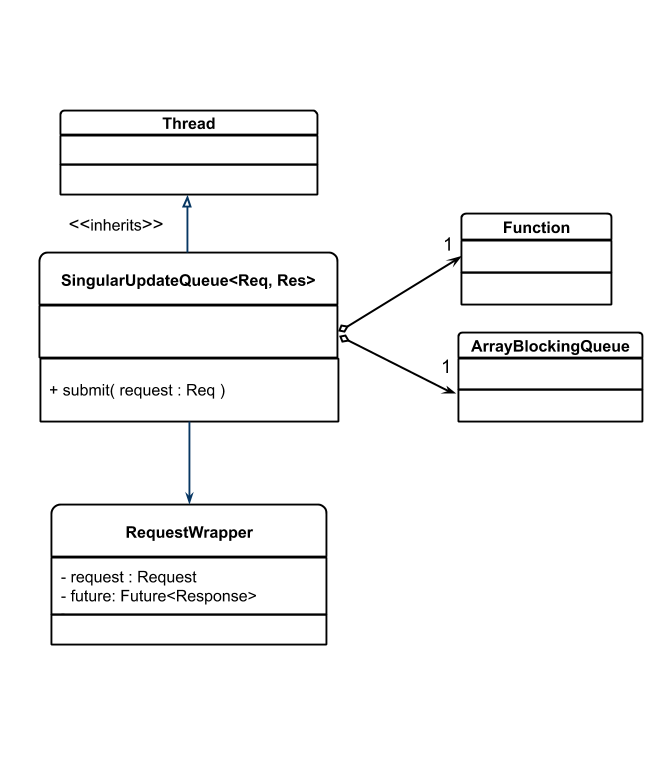

# 单一更新队列（Singular Update Queue）

**原文**

https://martinfowler.com/articles/patterns-of-distributed-systems/singular-update-queue.html

使用一个单独的线程异步地处理请求，维护请求的顺序，无需阻塞调用者。

**2020.8.25**

## 问题

有多个并发客户端对状态进行更新时，我们需要一次进行一个变化，这样才能保证安全地进行更新。考虑一下[预写日志（Write-Ahead Log）](write-ahead-log.md)模式。即便有多个并发的客户端在尝试写入，我们也要一次处理一项。通常来说，对于并发修改，常用的方式是使用锁。但是如果待执行的任务比较耗时，比如，写入一个文件，那阻塞其它调用线程，直到任务完成，这种做法可能会给这个系统的吞吐和延迟带来严重的影响。在维护一次处理一个的这种执行的保障时，有效利用计算资源是极其重要的。

## 解决方案

实现一个工作队列，以及一个工作在这个队列上的单一线程。多个并发客户端可以将状态变化提交到这个队列中。但是，只有一个线程负责状态的改变。对于像 Golang 这样支持 goroutine 和通道（Channel）的语言，实现起来会比较自然。


<center>图1：工作队列支持的单一线程</center>

下面是一个典型的 Java 实现：


<center>图2：Java 的 SingularUpdateQueue</center>

SingleUpdateQueue 有一个队列，还有一个函数用于处理队列中的工作项。它扩展了 java.lang.Thread，确保它只有一个执行线程。

```java
public class SingularUpdateQueue<Req, Res> extends Thread implements Logging {
    private ArrayBlockingQueue<RequestWrapper<Req, Res>> workQueue
            = new ArrayBlockingQueue<RequestWrapper<Req, Res>>(100);
    private Function<Req, Res> handler;
    private volatile boolean isRunning = false;
```

客户端在自己的线程里将请求提交到队列里。队列用一个简单的封装（wrapper）将每个请求都封装起来，然后和一个 Future 合并起来，把这个 Future 返回给客户端，这样，一旦请求最终处理完成，客户端就可以进行相应地处理。

```java
class SingularUpdateQueue…
  public CompletableFuture<Res> submit(Req request) {
      try {
          var requestWrapper = new RequestWrapper<Req, Res>(request);
          workQueue.put(requestWrapper);
          return requestWrapper.getFuture();
      }
      catch (InterruptedException e) {
          throw new RuntimeException(e);
      }
  }

class RequestWrapper<Req, Res> {
    private final CompletableFuture<Res> future;
    private final Req request;

    public RequestWrapper(Req request) {
        this.request = request;
        this.future = new CompletableFuture<Res>();
    }

    public CompletableFuture<Res> getFuture() { return future; }
    public Req getRequest()                   { return request; }
```

队列里的元素由一个专用的线程处理，SingularUpdateQueue 继承自 Thread。队列允许多个并发的生产者添加执行任务。队列的实现应该是线程安全的，即便在有争用的情况下，也不会增加很多的负担。执行线程从队列中取出请求，一次一个地处理。任务执行完毕，就可以用任务的应答去结束 CompletableFuture。

```java
class SingularUpdateQueue…
  @Override
  public void run() {
      isRunning = true;
      while(isRunning) {
          Optional<RequestWrapper<Req, Res>> item = take();
          item.ifPresent(requestWrapper -> {
              try {
                  Res response = handler.apply(requestWrapper.getRequest());
                  requestWrapper.complete(response);
              } catch (Exception e) {
                  requestWrapper.completeExceptionally(e);
              }
          });
      }
  }

class RequestWrapper…
  public void complete(Res response) {
      future.complete(response);
  }

  public void completeExceptionally(Exception e) {
      e.printStackTrace();
      getFuture().completeExceptionally(e);
  }
```

值得注意的是，从队列中读取内容时，我们可以有一个超时时间，而不是无限地阻塞。这样，必要的时候，我们可以退出线程，也就是将 isRunning 设为 false，即便队列为空，它也不会无限地阻塞在那里，进而阻塞执行线程。因此，我们要使用有超时时间的 poll 方法，而不是 take 方法，那样会无限阻塞的。这给了我们干净地停止线程执行的能力。

```java
class SingularUpdateQueue…
  private Optional<RequestWrapper<Req, Res>> take() {
      try {
          return Optional.ofNullable(workQueue.poll(300, TimeUnit.MILLISECONDS));
      } catch (InterruptedException e) {
          return Optional.empty();
      }
  }

  public void shutdown() {
      this.isRunning = false;
  }
```

比如，一个服务器处理来自多个客户端的请求，更新预写日志，它就可以有一个下面这样的 SingularUpdateQueue：


<center>图3：更新预写日志的 SingularUpdateQueue</center>

SingularUpdateQueue 客户端的设置要指定其参数化类型以及处理队列消息的函数。就这个例子而言，我们用的是处理预写日志请求的消费者。这个消费者有唯一一个实例，控制着对日志数据结构的访问。消费者将每个请求写入一条日志，然后返回一个应答。应答消息只有在消息写入日志之后才会发送出去。我们使用 SingularUpdateQueue 确保这些动作有可靠的顺序。

```java
public class WalRequestConsumer implements Consumer<Message<RequestOrResponse>> {

    private final SingularUpdateQueue<Message<RequestOrResponse>, Message<RequestOrResponse>> walWriterQueue;
    private final WriteAheadLog wal;

    public WalRequestConsumer(Config config) {
        this.wal = WriteAheadLog.openWAL(config);
        walWriterQueue = new SingularUpdateQueue<>((message) -> {
            wal.writeEntry(serialize(message));
            return responseMessage(message);
        });
        startHandling();
    }

    private void startHandling() { this.walWriterQueue.start(); }
```
消费者的 accept 方法接到这些消息，将它们放入到队列里，在这些消息处理之后，发出一个应答。这个方法在调用者线程运行，允许多个调用者同事调用 accept 方法。

```java
@Override
public void accept(Message message) {
    CompletableFuture<Message<RequestOrResponse>> future = walWriterQueue.submit(message);
    future.whenComplete((responseMessage, error) -> {
        sendResponse(responseMessage);
    });
}
```
### 队列的选择

队列的数据结构是一个至关重要的选择。在 JVM 上，有不同的数据结构可选：

* ArrayBlockingQueue（Kafka 请求队列使用）

正如其名字所示，这是一个以数组为后端的阻塞队列。当需要创建一个固定有界的队列时，就可以使用它。一旦队列填满，生产端就阻塞。它提供了阻塞的背压方式，如果消费者慢和生产者快，它就是适用的。

* ConcurrentLinkedQueue 联合 ForkJoinPool （Akka Actor 邮箱中使用）

ConcurrentLinkedQueue 可以用在这样的场景下，没有消费者在等待生产者，但在任务进入到 ConcurrentLinkedQueue 的队列之后，有协调者去调度消费者。

* LinkedBlockingDeque（Zookeeper 和 Kafka 应答队列使用）

如果不阻塞生产者，而且需要的是一个无界队列，它是最有用的。选择它，我们需要谨慎，因为如果没有实现背压技术，队列可能会很快填满，持续地消耗掉所有的内存。

* RingBuffer（LMAX Disruptor 使用）

正如 LMAX Disruptor 所讨论的，有时，任务处理是延迟敏感的。如果使用 ArrayBlockingQueue 在不同的处理阶段复制任务，延迟会增加，在一些情况下，这是无法接受的。在这些情况下，就可以使用 [RingBuffer](https://lmax-exchange.github.io/disruptor/files/Disruptor-1.0.pdf) 在不同的阶段之间传递任务。

### 使用通道和轻量级线程

有一些语言或程序库支持轻量级线程以及通道概念（比如，Golang、Kotlin），这一点就很自然了。所有的请求都传进一个单独的通道去处理。还有一个单独的 goroutine 去处理所有的消息更新状态。之后，应答写入到一个单独的通道中，有一个单独的 goroutine 处理，发回给客户端。正如我们在下面的代码中看到的，更新键和值的请求传给一个单独的共享的请求通道。

```go
func (s *server) putKv(w http.ResponseWriter, r *http.Request)  {
  kv, err := s.readRequest(r, w)
  if err != nil {
    log.Panic(err)
    return
  }

  request := &requestResponse{
    request:         kv,
    responseChannel: make(chan string),
  }

  s.requestChannel <- request
  response := s.waitForResponse(request)
  w.Write([]byte(response))
}
```

在一个单独的 goroutine 中处理请求更新所有的状态。

```go
func (s* server) Start() error {
  go s.serveHttp()

  go s.singularUpdateQueue()

  return nil
}

func (s *server) singularUpdateQueue() {
  for {
    select {
    case e := <-s.requestChannel:
      s.updateState(e)
      e.responseChannel <- buildResponse(e);
    }
  }
}
```

### 背压

工作队列用于在线程间通信，所以，背压是一个重要的关注点。如果消费者很慢，而生产者很快，队列就可能很快填满。除非采用了一些预防措施，否则，如果大量的任务填满队列，内存就会耗光。通常来说，队列是有界的，如果队列满了，发送者就会阻塞。比如，java.util.concurrent.ArrayBlockingQueue 有两个方法添加元素，put 方法在数组满的情况下就会阻塞，而 add 方法则会抛出 IllegalStateException，却不会阻塞生产者。很重要的一点就是，在添加任务到队列时，需要了解方法的语义。如果用的是 ArrayBlockingQueue，应该使用 put 方法阻塞发送者，通过阻塞，提供背压能力。类似于 reactive-streams 这样的框架，可以帮助我们实现更复杂的背压机制，从消费者到生产者。

### 其它考量

* 任务链

在大多数情况下，处理过程需要将多个任务串联在一起完成。SingularUpdateQueue 执行的结果需要传递给其它阶段。比如，正如上面在 WalRequestConsumer 里看到的，在记录写到预写日志之后，应答需要通过 Socket 连接发出去。这可以通过在一个单独的线程中执行 SingularUpdateQueue 返回的 Future 达成，也可以将任务提交给另一个 SingularUpdateQueue。

* 调用外部的服务

有时，作为 SingularUpdateQueue 任务执行的一部分，还需要调用外部服务，然后，根据服务调用的应答更新 SingularUpdateQueue 的状态。在这种场景下，要进行非阻塞的网络调用，或者，只有处理所有任务的线程阻塞。调用需要异步进行。还有一点必须要注意，在异步服务调用后的 Future 回调中，不要访问 SingularUpdateQueue 的状态，因为这另外一个的线程可能访问这个状态，这么做会破坏 SingularUpdateQueue 由一个单独线程进行所有状态修改的约定。调用的结果应该和其它的事件或请求一样，也添加到一个工作队列里。

## 示例

所有共识算法的实现，比如，Zookeeper（ZAB） 或 etcd（RAFT），都需要请求按照严格的顺序处理，一次一个。它们都有相似的代码结构。

* Zookeeper 的[请求处理管道](https://github.com/apache/zookeeper/blob/master/zookeeper-server/src/main/java/org/apache/zookeeper/server/SyncRequestProcessor.java)的实现是由一个单独线程的请求处理器完成的。
* Apache Kafka 的 [Controller](https://cwiki.apache.org/confluence/display/KAFKA/Kafka+Controller+Redesign)，需要基于多个来自于 zookeeper 的并发事件进行状态更新，由一个单独的线程处理，所有的事件处理器都要向队列里提交事件。
* Cassandra，采用了[SEDA](https://dl.acm.org/doi/10.1145/502034.502057)架构，使用单线程阶段更新其 Gossip 状态。
* [etcd](https://github.com/etcd-io/etcd/blob/master/etcdserver/raft.go)和其它基于 golang 的实现都有一个单独的 goroutine 处理请求通道，更新其状态。
* [LMAX Disruptor 架构](https://lmax-exchange.github.io/disruptor/files/Disruptor-1.0.pdf)遵循[单一写者原则（Single Writer Principle）](https://mechanical-sympathy.blogspot.com/2011/09/single-writer-principle.html)，避免在更新本地状态时出现互斥。
